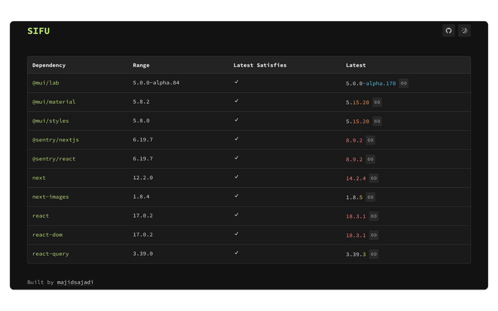

<h1 align="center">
  Sifu
</h1>

  
   

  
  
  

Web development evolves rapidly, with new package versions released daily. This fast pace can quickly render your project's dependencies outdated. Updating these dependencies is challenging and risky, especially for production projects with many users relying on them. New versions can introduce breaking changes, security vulnerabilities, or issues in the dependencies of your dependencies.

Enter **Sifu** or `Should I F***ing Update?`

Sifu is an application that provides insights into every version of a dependency, helping you make informed decisions about updating your project's dependencies. It offers detailed information and guidance, minimizing the risks and ensuring your project stays secure and up-to-date.

I suggest checking out [the link](https://sifuapp.vercel.app/dependencies/react?source=18.0.0&target=18.3.1) to the application page which compares React version `18.0.0` and `18.3.1`: 

### Features

- **Find Latest Versions**: Retrieve the latest version of dependencies listed in your `package.json` from the registry.
- **Git Commits**: View the git commits between the current and latest versions.
- **Changelog**: Access the changelog entries between the current and latest versions.
- **Security Advisories**: Identify security advisories that affect each version.
- **Dependency Changes**: Show changes in the dependencies of the current and latest versions (or any other versions).
- **Engine Changes**: Show changes in the engines of the current and latest versions (or any other versions).

### Disclaimer

Sifu is currently in the early stages of active development. As such, the project may experience bugs and frequent changes. We appreciate your understanding and welcome any feedback or contributions to help improve the application.

### Contribution
We highly appreciate every contribution to Sifu, whether it's a feature request, code contribution, bug report, or testing the application. Your involvement helps us improve and expand the project.
